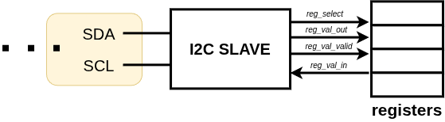
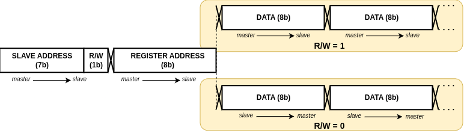

# i2c-slave
This repository holds simple implementation of 7bit I2C slave.
> [!WARNING]
> This repository is under development and this README now serves for notes rather than for description.
Features:
- Register-based interface for easy implementation into system
- Classic 8bit bus width, with 7bit slave address
- UVM-based verification
- Clock stretching **not implemented yet**

For further low-level details about I2C communication, please read [related spec](https://www.nxp.com/docs/en/user-guide/UM10204.pdf).

## Usage
`i2c-slave` aims to be generic and simple to use in your design, exposing its register interface only while handling all the low-level and link-layer (slave address + reg address + data ...) communication. It's up to user to provide registers outside of the slave and define their behaviour when written to or read from. 



Top-level design follows common I2C link layer pattern, thus expecting:




This behaviour is embedded inside the `i2c-slave` itself, enhancing lower-level module `i2c_slave_core.sv`, which processes single bits only which not interpreting them. Thus for modifying the link layer pattern, one may reuse the lower-level module. 

## Verification
Verification flow is managed by [open-chip-flow (OCF)](https://github.com/petrcechura/open-chip-flow) with dedicated UVM library and custom (I2C, CLK, ...) agents. 

For running a verification, first clone a repository with all submodules:
```
    git clone --recurse-submodules git@github.com:petrcechura/i2c-slave.git
```
In root, symbolic link `run.py` is located, which allows to easily run OCF flow from command line. Run `python3 run.py --help` to see available options.
Example command for running single test is as follows:
```
    python3 run.py verif i2c_slave.yaml --test i2c_slave_test_rw
```

TODO
Tests:
- Simple R/W
- Two subsequent reads
- Two subsequent writes
- Invalid slave address
- Valid slave address in non-first byte
- Asynchronous reset
- Communication interrupt