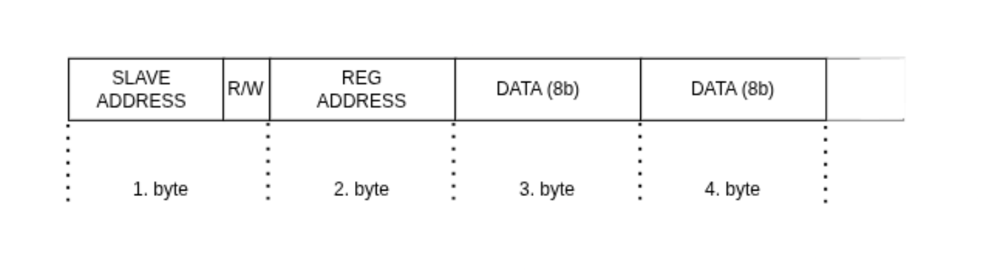

# i2c-slave
This repository holds simple implementation of 7bit I2C slave.

## Specification

Implementation follows standard I2C protocol features, thus expecting following communication pattern

## Verification
For verification, [open-chip-flow](https://github.com/petrcechura/open-chip-flow) has been used as automation . 